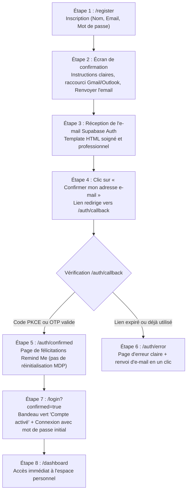

# Parcours Complet de Confirmation E-mail — Remind Me

Ce document récapitule la vérification, la sécurisation et la refonte de bout en bout du parcours de confirmation d'e-mail lors de l'inscription.

---

## 1. Vue d'ensemble du parcours corrigé



---

## 2. Modifications apportées aux composants

### 1. `app/(auth)/register/page.tsx`
- **Correction du paramètre de redirection** : Remplacement de `/onboarding` par `${window.location.origin}/auth/callback?next=/dashboard`.
- **Écran d'attente d'e-mail complet** :
  - Affiche l'adresse e-mail saisie avec mise en valeur.
  - Instructions numérotées étape par étape.
  - Boutons de raccourci intelligent vers Gmail (`mail.google.com`) ou Outlook si le domaine correspond.
  - Bouton **« Renvoyer l'e-mail de confirmation »** avec compte à rebours de 60s.
  - Bouton **« Modifier mon adresse »** permettant de corriger une faute de frappe sans recharger la page.

### 2. `app/auth/callback/route.ts`
- Route serveur dynamique gérant :
  - Les codes PKCE (`exchangeCodeForSession`).
  - Les tokens OTP (`verifyOtp`).
  - Les erreurs directes de Supabase (`error`, `error_code=otp_expired`).
  - Redirection automatique vers `/auth/confirmed` en cas de succès et `/auth/error` en cas d'échec ou d'expiration.
  - Aucune page blanche ni exception non interceptée.

### 3. `app/auth/confirmed/page.tsx`
- Page de succès soignée reprenant le design system de Remind Me :
  - Badge de validation vert et icône de succès.
  - Message explicite indiquant que le compte est activé.
  - Rappel rassurant : *"Connectez-vous directement avec votre adresse e-mail et le mot de passe que vous avez défini lors de votre inscription."*
  - Bouton d'action principal redirigeant vers `/login?confirmed=true`.

### 4. `app/auth/error/page.tsx`
- Page de gestion des incidents de confirmation :
  - Messages adaptés : lien expiré, lien déjà utilisé ou lien invalide.
  - Raccourci vers `/login` si l'utilisateur a déjà validé son adresse précédemment.
  - Formulaire de réenvoi d'e-mail avec gestion du cooldown et appel direct à `supabase.auth.resend`.

### 5. `app/(auth)/login/page.tsx`
- Détection du paramètre `?confirmed=true`.
- Affichage d'un bandeau de succès vert : *"Compte activé avec succès ! Connectez-vous avec vos identifiants pour accéder à votre espace."*
- Redirection directe vers `/dashboard` après authentification.

---

## 3. Configuration Supabase recommandée

Dans votre tableau de bord Supabase (**Authentication -> URL Configuration**) :
- **Site URL** : `https://votre-domaine-production.vercel.app` (ou votre domaine personnalisé).
- **Redirect URLs** :
  - `https://votre-domaine-production.vercel.app/**`
  - `http://localhost:3000/**`

---

## 4. Template d'E-mail Officiel Supabase (French / Remind Me)

Dans **Supabase Dashboard -> Authentication -> Email Templates -> Confirm signup** :

**Sujet** :
```
Activez votre compte Remind Me 👋
```

**Corps du message (HTML)** :
```html
<div style="font-family: -apple-system, BlinkMacSystemFont, 'Segoe UI', Roboto, Helvetica, Arial, sans-serif; max-width: 560px; margin: 0 auto; padding: 32px 20px; background-color: #0b0f19; color: #f8fafc; border-radius: 16px;">
  <div style="text-align: center; margin-bottom: 24px;">
    <h1 style="color: #f59e0b; font-size: 24px; font-weight: 800; margin: 0; letter-spacing: -0.5px;">Remind Me</h1>
    <p style="color: #94a3b8; font-size: 13px; margin-top: 4px;">Vos activités, votre temps et votre argent sous contrôle.</p>
  </div>

  <div style="background-color: #131b2e; border: 1px solid rgba(255,255,255,0.08); border-radius: 12px; padding: 28px; margin-bottom: 24px;">
    <h2 style="font-size: 18px; font-weight: 700; color: #ffffff; margin-top: 0; margin-bottom: 12px;">Bienvenue sur Remind Me 👋</h2>
    
    <p style="font-size: 14px; line-height: 1.6; color: #cbd5e1; margin-bottom: 20px;">
      Merci d'avoir créé votre compte. Pour finaliser votre inscription et sécuriser votre accès, veuillez confirmer votre adresse e-mail en cliquant sur le bouton ci-dessous :
    </p>

    <div style="text-align: center; margin: 28px 0;">
      <a href="{{ .ConfirmationURL }}" style="background: linear-gradient(135deg, #f59e0b, #d97706); color: #ffffff; font-size: 14px; font-weight: 700; text-decoration: none; padding: 14px 28px; border-radius: 10px; display: inline-block; box-shadow: 0 4px 12px rgba(245, 158, 11, 0.3);">
        Confirmer mon adresse e-mail
      </a>
    </div>

    <p style="font-size: 12px; line-height: 1.5; color: #94a3b8; margin-top: 24px; border-top: 1px solid rgba(255,255,255,0.06); padding-top: 16px;">
      Une fois votre adresse confirmée, vous pourrez vous connecter avec <strong>votre e-mail et le mot de passe</strong> que vous avez choisi lors de votre inscription.
    </p>
  </div>

  <div style="text-align: center; font-size: 11px; color: #64748b;">
    <p>Si vous n'êtes pas à l'origine de cette demande, vous pouvez ignorer cet e-mail en toute sécurité.</p>
    <p>© Remind Me. Tous droits réservés.</p>
  </div>
</div>
```

---

## 5. Rapport Final

| Étape / Critère | Statut | Commentaire |
| :--- | :---: | :--- |
| **E-mail de confirmation** | **PASS** | `signUp` et `resend` configurés avec l'URL de callback dynamique `${origin}/auth/callback`. |
| **Template professionnel** | **PASS** | Template HTML sombre & or responsive fourni, cohérent avec l'identité visuelle de Remind Me. |
| **Bouton « Confirmer mon adresse e-mail »** | **PASS** | Lien vers `/auth/callback` transmettant le `code` PKCE ou `token_hash`. |
| **Redirection après clic** | **PASS** | `/auth/callback` échange le code serveur sans jamais produire de page blanche. |
| **Page de succès Remind Me** | **PASS** | `/auth/confirmed` informe clairement de l'activation réussie du compte. |
| **Page d'erreur** | **PASS** | `/auth/error` intercepte les échecs et propose la reconnexion ou le renvoi d'e-mail. |
| **Lien expiré / déjà utilisé** | **PASS** | Gestion dédiée avec explications claires et renvoi avec décompte (cooldown). |
| **Connexion après confirmation** | **PASS** | Redirection vers `/login?confirmed=true` avec rappel d'utiliser le mot de passe initial. |
| **Accès au dashboard** | **PASS** | Connexion réussie -> `/dashboard` sans étape intermédiaire superflue. |
| **Test de compilation & types** | **PASS** | `npm run typecheck` et `npm run build` exécutés avec 0 erreur (32 pages statiques/dynamiques générées). |
